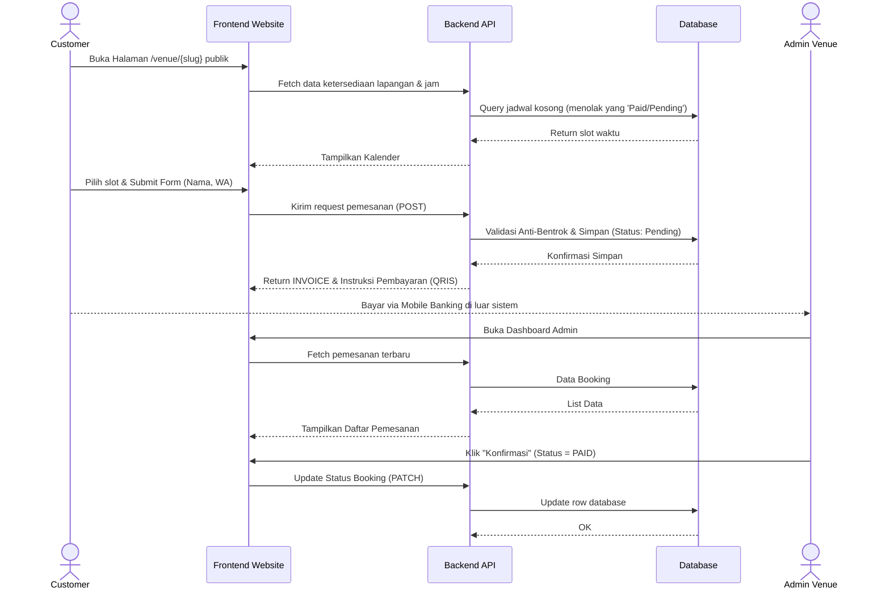
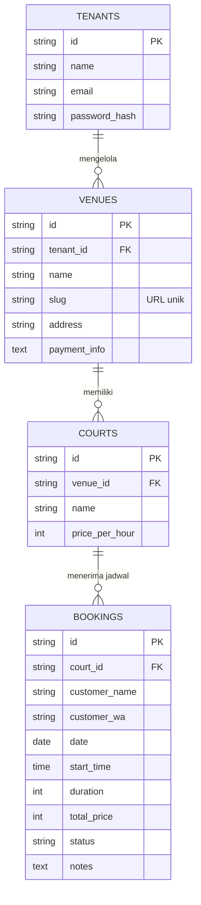

# PRD — Project Requirements Document

## 1. **Overview**
Aplikasi ini adalah platform sistem *booking* (pemesanan) lapangan padel berbasis web yang dirancang khusus untuk pemilik *venue* di Indonesia. Dengan menganut model *multitenant*, aplikasi ini memungkinkan banyak pemilik bisnis mendaftar, memiliki akun terpisah, dan mengelola lapangan mereka sendiri di dalam satu platform.

**Masalah yang diselesaikan:**
Selama ini, pemilik *venue* masih menerima dari pelanggan secara manual melalui WhatsApp, yang sering kali menyebabkan bentrok ketersediaan jadwal (*double booking*), membuang banyak waktu admin untuk merespons chat, dan menyulitkan pelanggan karena tidak bisa melihat slot waktu yang kosong secara *real-time*.

**Tujuan Utama:**
Menyediakan solusi digital yang cepat dan praktis di mana pelanggan bisa langsung melihat jadwal kosong dan memesan lapangan tanpa perlu membuat akun (*guest checkout*). Di sisi lain, pemilik *venue* mendapatkan *dashboard* yang rapi untuk memantau pesanan, memverifikasi pembayaran manual (Transfer Bank/QRIS), dan mengelola ketersediaan banyak lapangan sekaligus.

## 2. **Requirements**
- **Sistem Multitenant:** Satu aplikasi dapat mewadahi banyak pemilik bisnis (*tenant*).
- **Hierarki Bisnis:** Setiap *tenant* dapat mendaftarkan lebih dari satu *venue* (lokasi cabang), dan setiap *venue* dapat memiliki banyak lapangan padel.
- **Halaman Publik Khusus:** Setiap *venue* memiliki tautan/URL unik sendiri yang bisa dibagikan ke media sosial (contoh: `namaplatform.com/venue/padel-bekasi`).
- **Booking Tanpa Login:** Pelanggan publik harus dapat melihat daftar lapangan, kalender ketersediaan, harga, dan melakukan pemesanan tanpa harus mendaftar atau *login*.
- **Pencegahan Bentrok (Double Booking):** Validasi ketat di dalam sistem untuk memastikan lapangan tidak bisa dipesan di jam dan hari yang sama oleh dua pelanggan berbeda.
- **Alur Status Booking:** Setiap pemesanan harus melalui status yang jelas: *Pending Payment* (Menunggu Pembayaran), *Paid/Confirmed* (Dibayar/Dikonfirmasi), *Cancelled* (Dibatalkan), dan *Completed* (Selesai).
- **Pembayaran Manual:** Fasilitas bagi admin *venue* untuk menampilkan informasi pembayaran (Instruksi Transfer Bank, Rekening, atau gambar QRIS).
- **Pengumpulan Data Pelanggan:** Formulir *booking* publik wajib mengumpulkan data esensial: Nama, Nomor WhatsApp, Tanggal, Jam Mulai, Durasi Bermain, dan Catatan Opsional.
- **Tampilan Berbasis Profil Mobile:** Antarmuka harus dioptimalkan secara maksimal untuk layar ponsel (*mobile-friendly*), mengingat kebiasaan mayoritas pengguna Indonesia.

## 3. **Core Features**
- **Dashboard Admin & Kalender Manajemen:** Panel kontrol untuk admin melihat seluruh jadwal lapangan dalam bentuk kalender, menyetujui, menolak, atau mengupdate status *booking* pelanggan.
- **Halaman Checkout Praktis:** Pengalaman pemesanan di mana pelanggan cukup menekan tanggal dan jam yang kosong, mengisi nama & nomor WA, lalu langsung mendapatkan instruksi pesanan (kurang dari 1 menit).
- **Ketersediaan Slot Real-time:** Halaman pelanggan otomatis diperbarui secara sistem tanpa perlu menebak-nebak jam berapa lapangan kosong.
- **Sistem Kelola Multi-Lapangan:** Fitur kelola (*Create, Read, Update, Delete*) nama lapangan, jam operasional, dan tarif sewa per jam per venue.
- **Panel Pembayaran Modifikasi:** Fitur di mana admin bisa mengunggah kode QRIS atau mengetik nomor rekening yang otomatis akan muncul di halaman *invoice* sementara pelanggan.

## 4. **User Flow**

**a. Alur Pelanggan (Customer Flow):**
1. Buka tautan publik spesifik milik *venue* dari Instagram atau WhatsApp.
2. Melihat daftar lapangan beserta tarif, lalu memilih tanggal.
3. Memilih jam yang masih berwarna hijau / tersedia.
4. Muncul *popup* form: Mengisi Nama, Nomor WA, dan Durasi main. Klik "Booking Sekarang".
5. Dialihkan ke halaman Ringkasan/Invoice. Melihat total biaya dan gambar kode QRIS / nomor rekening pemilik lapangan.
6. Melakukan transfer di luar sistem, lalu menghubungi admin *(opsional)* untuk memberitahu bahwa sudah bayar.
7. Saat admin sudah konfirmasi di sistem, pelangan dianggap sah memiliki waktu tersebut.

**b. Alur Admin (Venue Owner Flow):**
1. *Login* ke sistem menggunakan email dan password bawaan.
2. (Set up Awal): Menambahkan detail lokasi venue, jumlah lapangan padel, harga, serta mengunggah gambar QRIS untuk pembayaran.
3. Mendapatkan notifikasi atau melihat di *dashboard* ada pesanan baru masuk berstatus *Pending*.
4. Mengecek mutasi bank atau rekening apakah dana dari pelanggan tersebut sudah masuk.
5. Klik tombol "Konfirmasi Pembayaran", status *booking* berubah menjadi *Paid/Confirmed*.
6. Jadwal di halaman publik otomatis terblokir untuk pelanggan lain.

## 5. **Architecture**
Sistem menggunakan arsitektur *fullstack* berbasis **TanStack Start** yang menggabungkan routing, rendering híbrida (SSR/CSR), dan pembuatan *API routes* dalam satu ekosistem Vite. Database relational tunggal menangani isolasi data multitenant menggunakan Foreign Key (ID Tenant).

## 6. **Database Schema**
Aplikasi menggunakan sistem database relasional. Data dibedakan per-admin melalui relasi berantai dari Tenant → Venue → Court → Booking.

**Daftar Tabel dan Kolom:**

1. **`テナント (Tenants)` - Akun Pemilik Bisnis**
   - `id` (UUID/String): *Primary Key*.
   - `name` (String): Nama akun pemilik/perusahaan.
   - `email` (String): Untuk *login* akun.
   - `password_hash` (String): Kata sandi terenkripsi.
   
2. **`Lokasi (Venues)` - Cabang Tempat Lapangan**
   - `id` (UUID/String): *Primary Key*.
   - `tenant_id` (String): *Foreign Key* ke tabel *Tenants*.
   - `name` (String): Nama lokasi (misal: "Padel Senayan").
   - `slug` (String): URL *identifier* (misal: `padel-senayan`, harus unik).
   - `address` (Text): Alamat lengkap cabang.
   - `payment_info` (Text): Catatan instruksi transfer rekening bank / URL QRIS.

3. **`Lapangan (Courts)` - Fisik Lapangan Padel**
   - `id` (UUID/String): *Primary Key*.
   - `venue_id` (String): *Foreign Key* ke tabel *Venues*.
   - `name` (String): Nama atau nomor lapangan (Misal: "Court A").
   - `price_per_hour` (Integer): Harga sewa lapangan tersebut per 1 jam.

4. **`Pemesanan (Bookings)` - Transaksi Jadwal**
   - `id` (UUID/String): *Primary Key*.
   - `court_id` (String): *Foreign Key* ke tabel *Courts*.
   - `customer_name` (String): Nama pemesan.
   - `customer_wa` (String): Nomor WhatsApp pemesan.
   - `date` (Date): Tanggal main (YYYY-MM-DD).
   - `start_time` (Time): Jam mulai main (HH:MM).
   - `duration` (Integer): Durasi bermain dalam satuan jam (misal: 1, 2, 3).
   - `total_price` (Integer): Total tagihan yang harus dibayar.
   - `status` (String): Enum nilai (`PENDING`, `PAID`, `CANCELLED`, `COMPLETED`).
   - `notes` (Text): Pesan tambahan dari pelanggan opsional.

## 7. **Tech Stack**
Berikut adalah rekomendasi arsitektur teknologi yang kokoh dan tepat sasaran untuk mengembangkan platform ini dengan cepat, modern, dan performa tinggi:

- **Framework Web (Fullstack):** **TanStack Start** — Framework fullstack berbasis Vite yang menangani routing, rendering híbrida (SSR/CSR), dan *API routes* bawaan. Memisahkan logika frontend dan backend secara terstruktur namun tetap dalam satu repositori, mempercepat pengembangan MVP.
- **Styling & UI Components:** **Tailwind CSS** dipadukan dengan **shadcn/ui** untuk tampilan *dashboard* yang bersih, elegan, dan pastinya sangat responsif di layar handphone.
- **Database:** **SQLite** — Mengingat ini adalah MVP, SQLite sangat ringan, cepat dikerjakan, dan cocok untuk tahap pengujian awal ke pasar.
- **ORM (Object Relational Mapping):** **Drizzle ORM** untuk berinteraksi dengan database SQLite menggunakan *Typescript*. Sangat cepat dan ukurannya ringan.
- **Sistem Autentikasi Admin:** **Better Auth** — Menangani sesi login, registrasi, dan perlindungan keamanan khusus untuk halaman *Dashboard* (Tenant).
- **Deployment Platform:** **Vercel** — TanStack Start memiliki adapter resmi untuk Vercel yang memungkinkan deployment serverless tanpa konfigurasi rumit. Platform ini tetap menjadi pilihan utama untuk MVP berkat CI/CD otomatis, scaling instan, dan performa edge yang teroptimasi.
